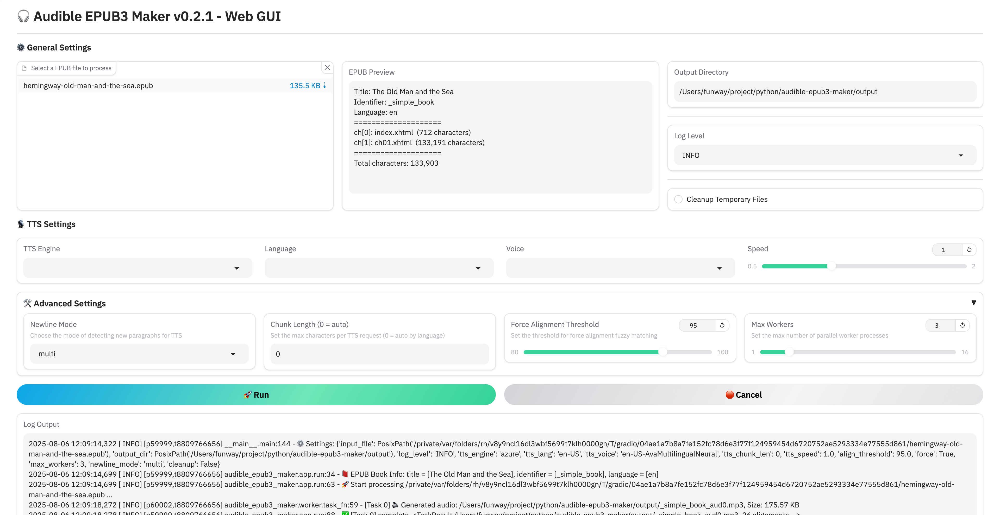

# 🎧 Audible EPUB3 Maker

Generate audiobooks from plain EPUB files in **EPUB3 Media Overlays** format using high-quality TTS (Text-to-Speech) engines like **Azure** and **Kokoro**, now with an intuitive **Web GUI**.

You can read or listen to the generated EPUB using any ebook reader that supports EPUB 3 Media Overlays, such as Thorium Reader. The generated MP3 files can also be played with any standard audio player.

---

## ✨ Features

- Convert plain EPUB books into audiobooks compliant with **[EPUB 3 Media Overlays](https://www.w3.org/TR/epub/#sec-media-overlays)** specification.
- Supports TTS engines:
  - [Azure TTS](https://learn.microsoft.com/en-us/azure/ai-services/speech-service/get-started-text-to-speech) (high-quality cloud service)
  - [Kokoro-82M](https://huggingface.co/hexgrad/Kokoro-82M) (offline open-source model)
- Automatic sentence segmentation and force alignment
- Parallel multi-process generation
- Gradio-based Web GUI for easy interaction without command line
- Docker-ready architecture for easy deployment

---

## 🛠 Installation

### ⚙️ From Source
#### 1. git clone & pip install
```bash
git clone https://github.com/funway/audible-epub3-maker.git 
cd audible-epub3-maker
pip install -r requirements.txt
```

#### 2. TTS Engine Configuration

Depending on the engine you plan to use, follow the steps below:

- **Azure**:
  - You must configure the following two environment variables:
    ```bash
    AZURE_TTS_KEY=your_azure_speech_key
    AZURE_TTS_REGION=your_speech_region
    ```
  - You can define them:
    - In a `.env` file in the project root (recommended)
    - Or `export` them manually in your shell or `.bashrc` / `.zshrc` file:
      ```bash
      export AZURE_TTS_KEY=your_azure_speech_key
      export AZURE_TTS_REGION=your_speech_region
      ```
  - [How to get Microsoft Azure Text-to-Speech API key](https://docs.merkulov.design/how-to-get-microsoft-azure-tts-api-key/)

- **Kokoro**:
  - No environment configuration is required.
  - The model file will automatically download on first use.


### 🐳 From Docker
We provide pre-built Docker images hosted at:

- Docker Hub: `funway/audible-epub3-maker`

- GitHub Container Registry (GHCR): `ghcr.io/funway/audible-epub3-maker`
  
The image includes all dependencies and runs the Web GUI by default.

#### Using docker-compose

A sample configuration file `docker-compose.example.yml` is included in the repository:

```
services:
  aem-web:
    image: ghcr.io/funway/audible-epub3-maker
    ports:
      - "7860:7860"
    volumes:
      - ./output:/app/output
    environment:
      - AZURE_TTS_KEY=your_azure_speech_key
      - AZURE_TTS_REGION=your_speech_region
    restart: unless-stopped
```

#### Using docker CLI 

```
docker pull ghcr.io/funway/audible-epub3-maker

docker run -d \
    -p 7860:7860 \
    -v ./output:/app/output \
    -e AZURE_TTS_KEY=your_azure_speech_key \
    -e AZURE_TTS_REGION=your_speech_region \
    ghcr.io/funway/audible-epub3-maker
```

### 💡 Notes

- **Using Azure TTS?** Make sure you set the `AZURE_TTS_KEY` and `AZURE_TTS_REGION` environment variables before starting the container.

- **Using Kokoro TTS?** Keep an eye on your system’s memory usage — the model runs locally and can consume several GB of RAM. On low-memory systems, this may cause OOM (out-of-memory) errors.

---

## 🚀 Usage

### 🖥️ CLI

```bash
python main.py <input_file.epub> [options]
```

#### Required:
- `input_file`: The path to the source EPUB file.

#### Optional arguments:

| Option                | Description                                      | Default                     |
|-----------------------|--------------------------------------------------|-----------------------------|
| `-d`, `--output_dir`  | Output directory                                 | `<input_file_stem>_audible` |
| `--log_level`         | Logging level (DEBUG, INFO, WARNING, ERROR, CRITICAL) | INFO                     |
| `--tts_engine`        | TTS engine (`azure` or `kokoro`)                 | azure                       |
| `--tts_lang`          | Language code                                    | en-US                       |
| `--tts_voice`         | Voice name                                       | en-US-AvaMultilingualNeural |
| `--tts_speed`         | Playback speed (e.g., 1.0 = normal)              | 1.0                         |
| `--tts_chunk_len`     | Max chars per TTS chunk                          | auto                        |
| `--newline_mode`      | How to detect paragraph breaks from newlines (`none`, `single`, `multi`) | multi |
| `-m`, `--max_workers` | Number of worker processes                       | 3                           |
| `--align_threshold`   | Force alignment fuzzy match threshold (0–100)    | 95.0                        |
| `-f`, `--force`       | Force all prompts (non-interactive mode)         | false                       |
| `--cleanup`           | Remove temp files (.mp3) after generation        | false                       |

#### Example

```bash
python main.py mybook.epub \
    --tts_engine azure \
    --tts_lang zh-CN \
    --tts_voice zh-CN-XiaoxiaoNeural \
    -d ./output_dir \
    -m 4 \
    --log_level DEBUG
```

### 🌐 Web GUI

```bash
python web_gui.py
```
#### Optional arguments:
| Argument       | Description                                               |
| -------------- | --------------------------------------------------------- |
| `--host HOST`  | Host to bind the Gradio web server (default: `127.0.0.1`) |
| `--port PORT`  | Port to bind the Gradio web server (default: `7860`)      |

Then open your browser and interact with the friendly interface!



---

## 💾 Output

- `*.mp3`: Generated audio for each chapter
- `*.epub`: A new EPUB file with embedded mp3 audio and synchronized smil overlays

---

## 📄 License

This project is licensed under the MIT License.

---

## 🚗 TODO
- Fix bug: multi workers download model file at the same time (when first use).
- Improve sentence segmentation accuracy
- Support for more offline TTS engines
- Integrate WhisperX to enable TTS engines without native word boundary output
  
---


